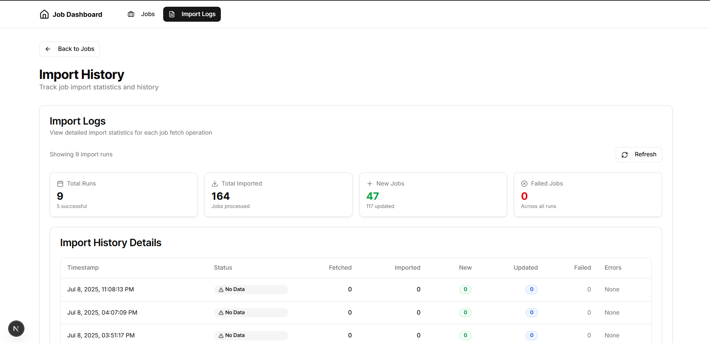

# Job Importer System

A full-stack system that fetches job listings from a real XML-based API, processes them through a BullMQ queue, stores the data in MongoDB, and displays results in a Next.js Admin UI.

## Screenshots

**Home Page**


**Single Job Page**


**Import Logs Page**


## Tech Stack

| Layer     | Technology                  |
| --------- | --------------------------- |
| Frontend  | Next.js (React) + Shadcn UI |
| Backend   | Node.js, Express            |
| Database  | MongoDB + Mongoose          |
| Queue     | BullMQ (Redis)              |
| Parser    | xml2js                      |
| Scheduler | node-cron                   |

## Directory Structure

```
/job-importer
├── /client            # Next.js admin UI
├── /server            # Node.js Express backend
│   ├── /controllers   # Route controllers
│   ├── /routes        # API route definitions
│   ├── /models        # Mongoose schemas
│   ├── /services      # Job fetch, processing logic
│   ├── /queues        # BullMQ job queues
│   ├── /workers       # BullMQ job processors
│   ├── /config        # DB, Redis, Cron setup
│   ├── .env           # Environment variables
│   ├── .gitignore     # Ignored files
│   ├── package.json   # Project configuration
│   ├── tsconfig.json  # TypeScript configuration
│   ├── pnpm-lock.yaml # pnpm lock file
│   └── index.ts       # App entry point
├── /docs              # Documentation folder
│   └── architecture.md
└── README.md          # Setup & usage guide
```

## Setup Instructions

### 1. Clone the Repository

```bash
https://github.com/BCAPATHSHALA/Job-Importer.git
cd Job-Importer
```

### 2. Install Dependencies

```bash
cd server
pnpm install

cd ../client
pnpm install
```

### 3. Configure Environment Variables

Create `.env` in `/server`:

```env
PORT=5000
MONGO_URL=mongodb+srv://<user>:<pass>@cluster.mongodb.net/?retryWrites=true&w=majority
REDIS_HOST=your_redis_host
REDIS_PORT=your_redis_port
REDIS_USERNAME=default
REDIS_PASSWORD=your_password
```

### 4. Run the Backend

```bash
cd server
pnpm run dev
```

This will:

- Connect to MongoDB
- Connect to Redis
- Start cron to fetch jobs every hour
- Start job worker to process queue

### 5. Run the Frontend (Next.js)

```bash
cd client
pnpm run dev
```

Then open: [http://localhost:3000](http://localhost:3000)

## API Endpoints (server)

| Method | Route           | Description            |
| ------ | --------------- | ---------------------- |
| GET    | `/api/jobs`     | Get all job listings   |
| GET    | `/api/jobs/:id` | Get specific job by ID |
| GET    | `/api/logs`     | View import log stats  |

## How It Works


1. Cron fetches job feed from an XML API every hour.
2. XML → JSON using `xml2js`
3. Jobs are added to `BullMQ` queue → stored in Redis
4. Worker processes the queue → saves/updates job in MongoDB
5. Logs import summary every 30 sec
6. Express API exposes the data
7. Next.js UI fetches and displays everything

## Documentation

Full technical explanation and architecture diagram:

```bash
/docs/architecture.md
```

## Credits

Built as a job importer system with self-learned Redis, BullMQ, and XML conversion — designed for modularity, scaling, and learning.
